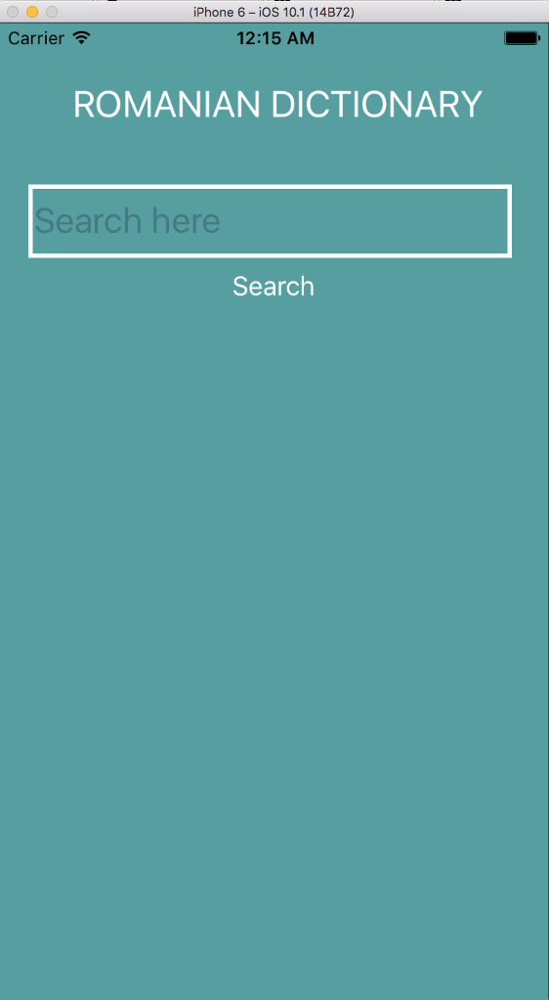
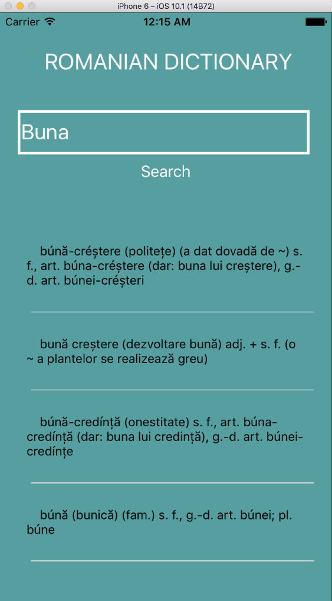

# Romanian-Dictionary

Simple React Native app using an API and showing some information on the screen. In this case, a dictionary.

## Setup

Install dependencies:
```
yarn
```

### Tests

```
yarn test
```


# Screenshots



